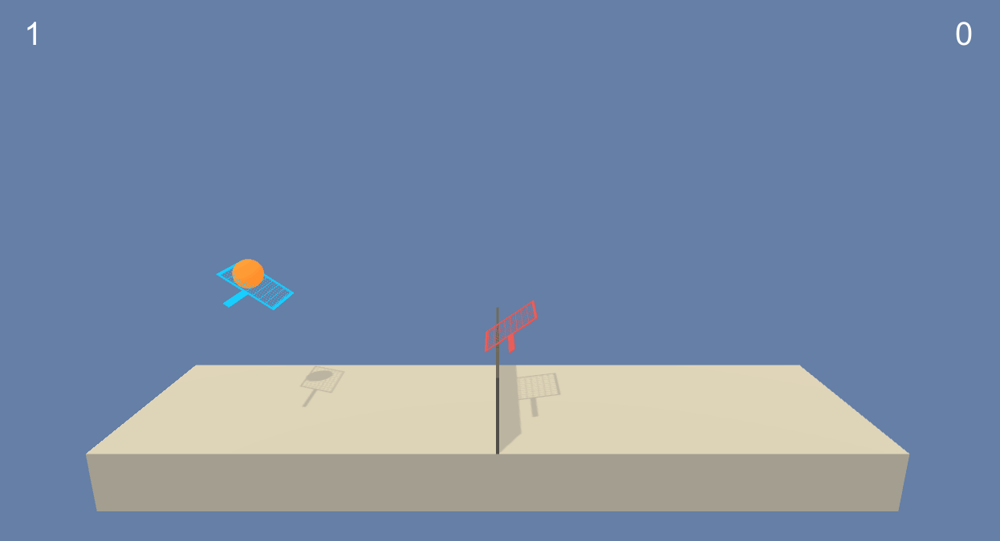
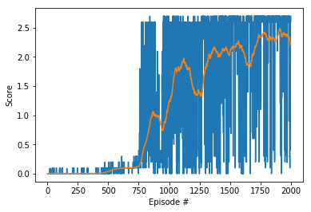

# Project 2: Continuous Control -- Report

​	This project was one of the requirements for completing the Deep Reinforcement Learning Nanodegree (DRLND) course at Udacity.com. The environment is a game of tennis. Two learning agents, represented by rackets, hit a ball back and forth between each other over a net. The game is actually in two dimensions only as the agents can only move towards and away from the net, as well as jump up. The ball and both players are always in the same vertical plane orthogonal to the net. During one episode of play, an agent earns a reward of +0.1 every time it hits the ball over the net. A negative reward of -0.01 is given if the ball hits the ground or goes out of bounds. Ideally, the two agents should learn how to keep the ball in play to earn a high total reward.




## Implementation

​	The implementation was adapted from the course materials. Specifically, it was based on the code for the pendulum environment from the Open AI Gym provided at the course repository (https://github.com/udacity/deep-reinforcement-learning/tree/master/ddpg-pendulum). Similar code was used to solve the previous project for the course (https://github.com/snhwang/p2-continuous-control-SNH.git).

​	The environment was created using Unity's ML Agents toolkit, but the learning algorithms were implemented with python 3.6 (specifically 3.6.6). The code was run using Jupyter notebook.

​	I utilized the deep deterministic policy gradient (DDPG) algorithm, which is a variant of the actor-critic learning method. An actor neural network predicts an action and the critic network models the goodness of the choice (i.e., Q value). This algorithm is discussed in more detail in Lillicrap et al. (Continuous Control with Deep Reinforcement Learning, https://arxiv.org/pdf/1509.02971.pdf). 

​	A few of the features of the algorithm are discussed in further detail below.	

#### Soft Updating

During training, the neural network weights are updated. This can become unstable or oscillatory, which was particularly problematic for this project. To reduce this, a method of "soft updating" is utilized. Rather than completely replacing the old weights with the new weights, the soft update method gradually blends in the local network to the target network. Basically it is a weighted average, strongly weighted to the original network so that changes occur gradually. The weight for the target network is `tau`, and the weight for the local network is thus `1-tau`:

`target_parameters(k+1) = tau * local_parameters(k) + (1-tau) * target_parameters(k)`,

where k is the timestep.

Smaller `tau` thus indicates the the weighting is shifted more towards the current target model. Since the weights are initialized randomly at the start of training, the weights early in training are likely not as useful. Also, as the neural networks learn, it may be benficial to decrease `tau` so that the changes to the neural network weights becomes more gentle. I modified the code to allow for starting with a high value of `tau` which decays towards a smaller value.

#### Action Noise

​	One of the problems of learning in continuous action spaces is enabling the learning agent to adequately explore the space in order to generate an adequate model. One method to achieve this is to add noise to the action. As was done by Lillicrap et al., an Ornstein-Uhlenbeck noise process was utilized. In the pendulum code, one of the terms for the noise process is a sampled for a uniform distribution. I changed this to a normal variate, which I think is the correct method. 

​	The two noise parameters that I varied were theta and sigma. In an Ornstein–Uhlenbeck process, theta is the rate at which a perturbation to the system reverts towards the mean, which is assumed to be zero for our purposes. The parameter sigma, which is the standard deviation of the normal variate component, is a measure of the volatility of the perturbations. 

​	The default values provided in the code for the pendulum environment were theta = 0.15 and sigma = 0.2 I tried a wide range of values above and below these values. Unlike the previous project in which I which the learning agent appeared to get "stuck" continuously repeating the same action with no improvement, the learning in the Tennis environment appeared to be more unstable. The agents would achieve very high scores >2 and would seem somewhat stable for multiple episodes but would then suddenly fail and only achieve very low scores close to zero. Some times there would not be a single crash, but scores would rise then fall repeatedly but would have an underlying trend of improvement.

​	For the previous project,  I used relatively large values for the noise parameters to "shock" the agents out of their repetitive actions. For the current project, I used small values to make the perturbations to the system more gentle to hopefully reduce the instability. I set the noise parameters to theta = 0.1 and sigma = 0.05.

#### Gradient Clipping

​	Gradient clipping is also utilized in the critic network to improve stability of the learning process. The magnitude of the gradients are limited to 1.

#### Experience Replay

​	The algorithm uses experience replay, which stores prior states and actions. Training is performed on a random sampling of the the stored items. For our previous project, I achieved success updating the neural network weights only 5 times after every 20 timesteps. This allows the algorithm to sample relatively uncorrelated data in the buffer since the samples are accumulated over more timesteps. I was unable to get this to work for the current project. I had to increase the number of updates to 15 after every 20 timesteps.

​	The very first update during training is delayed until there is adequate data stored in the experience replay buffer for training in the neural networks. Although only enough data for one mini batch is necessary to perform training, I increased this to having stored at least 10 times the batch size to accumulate more data before training. 

#### Evolving Learning Parameters

​	Gamma is the discount factor for Q learning for indicating a preference for current rewards over potential future rewards. In the setting of deep Q learning, Francois-Lavet et al. (How to Discount Deep Reinforcement Learning: Towards New Dynamic Strategies, https://arxiv.org/abs/1512.02011) recommend gradually increasing gamma as learning progresses. I used a variation of this technique and allowed gamma to increase according to:

`gamma(k + 1) = gamma_final + (1 - gamma_rate) * (gamma_final - gamma(k))`

The following were my final choices for values but I tried different values for the rate:

```
gamma_initial = 0.95,
gamma_final = 0.99,
gamma_rate = 0.01
```

I did not have time to do enough runs to determine if this was helpful or not.

As I mentioned above, `tau`, the weighting factor for soft updating, also could evolve according to:

`tau(k + 1) = tau_final + (1 - tau_rate) * (tau_final - tau(k))`

For the current project, I made tau decay from 0.01 to 0.001 with a rate of 0.001.

For decaying the magnitude of noise, I just use a multiplicative factor, where factor < 1:

`scaling_factor(k+1) = scaling_factor(k) * noise_factor`

The noise is then multiplied by `scaling_factor`.

#### The Neural Networks

For the previous project, I was initially successful with neural networks using SELU activations and 3 fully connected layers to achieve the required scores. I thus initially tried to use the same type of neural network but was unsuccessful I switched back to RELU activations and added batch normalization before the state input as well as between all of the layers in the actor network as suggested by Lillicrap et al. I also followed the recommendation to apply batch normalization at every layer before the action input for the critic network. I could not achieve decent scores until I went back to 2 fully connected layers. I also was more successful, in terms of speed of learning and scores, when I removed some of the batch normalization. The current version has batch normalization only for the state inputs of both the actor and critic networks. Please keep in mind that I only performed manual  testing and only tried a few different variations. More formalized and thorough testing would be required to generate an optimal model. Similarly, although I was not as successful with the SELU activations, my testing was too limited to definitively conclude that SELU is not as good for this application. One reasons is that the inputs to SELU are supposed to have a specific weight initialization with zero mean and standard deviation of the squared root of 1/(size of input). However, I have not implemented this yet.

The following is my final actor neural network structure for this project:

1. Batch normalization of the state input (size 8)
2. fully connected layer  with a number of inputs equal to the state size and 128 outputs
3. Rectified Linear Unit (ReLU)
4. fully connected layer (128 in and 128 out)
5. ReLU
6. fully connected layer (128 in. The number of outputs is the action size 2)

The critic network was similar:

1. Batch normalization of the state input (size 8)
2. fully connected layer  with a number of inputs equal to the state size and 128 outputs
3. Concatenate the action
4. Rectified Linear Unit (ReLU)
5. fully connected layer. The number of inputs is 128 + the action size.  128outputs
6. ReLU
7. fully connected layer(128 in and a single output representing the Q value)

I will not discuss my network with SELU network further here since I was never successful with it for this project.

The learning utilizes the Adam optimizer.

## Learning Algorithm

#### Agent parameters

The following parameters determine the learning agent:

```
    state_size: Number of parameters defining the environmen state
    action_size: Number of pameters definine the actions
    num_agents: Number of learning agents
    random_seed: Random seed number
    batch_size: Batch size for neural network training
    lr_actor: Learning rate for the actor neural network
    lr_critic: Learning rate for the critic neural network
    noise_theta (float): theta for Ornstein-Uhlenbeck noise process
    noise_sigma (float): sigma for Ornstein-Uhlenbeck noise process
    actor_fc1 (int): Number of hidden units in the first fully connected layer of the
    	actor network
    actor_fc2: Units in second layer
    actor_fc3: Units in third fully connected layer. This parameter does nothing for
    	the "RELU" network
    critic_fc1: Number of hidden units in the first fully connected layer of the critic
    	network
    critic_fc2: Units in second layer
    critic_fc3: Units in third layer. This parameter does nothing for the "RELU" 			network
    update_every: The number of time steps between each updating of the neural networks 
    num_updates: The number of times to update the networks at every update_every 			interval
    buffer_size: Buffer size for experience replay. Default 2e6.
    network (string): The name of the neural networks that are used for learning.
        There are 	only 2 choices, one with only 2 fully connected layers and RELU
        activations and one with 3 fully connected layers with SELU activations.
        Their names are "RELU" and "SELU," respectively. Default is "RELU." The SELU
        network did not work well, so it is best to stick with "RELU."

```

#### Training parameters

This learning process is implemented in section 3 of the Jupyter notebook, Tennis-SNH.ipynb , as `ddpg`. Running `ddpg` returns a list of  scores and 100-episode-average maximum scores. These parameters which adjust the learning for `ddpg` are the following:

```
agent (Agent): The learning agent
n_episodes (int): Maximum number of training episodes
max_t (int): Maximum number of timesteps per episode
gamma_initial (float): Initial gamma discount factor (0 to 1). Higher values favor long term over current rewards.
gamma_final (float): Final gamma discount factor (0 to 1).
gammma_rate (float): A rate (0 to 1) for increasing gamma.
tau_initial (float): Initial value for tau, the weighting factor for soft updating the neural networks.
tau_final (float): Final value of tau.
tau_rate (float): Rate (0 to 1) for increasing tau each episode.
noise_factor (float<=1): The value for scaling the noise every episode to gradually 	decrease it.
```

The training is performed by looping through multiple episodes of the environment. For each episode the environment is reset with:

```
# Reset the environment
env_info = env.reset(train_mode=True)[brain_name]
```

Note that the training mode is activated unlike when running the agent without training as will be discussed in the next section. Within each episode, there is an inner loop for all of the time steps in the episode. For each time step:

1. Get an action
2. Send the action to the environment
3. Get the next state
4. Get the reward
5. Add the state, action, reward, and next state to the experience replay buffer. 
6. Every 20 time steps in the environment, randomly sample the experience replay buffer and perform 15 learning steps. Each learning step consists of updating the critic network, then updating the actor network.
7. The reward is added to the score
8. Update the state to the next state and loop back to step 1 for the next time step until the episode is done.

Each action is chosen in step 1 with:

    # Get actions
    action = agent.act(state, noise_scale)
where `noise_scale` is the factor discussed previously that scales the noise, intended to gradually reduce the noise for later episodes. Note that `agent.act` includes a parameter `add_noise` which is boolean and defaults to `True`. This indicates that action noise is added to the chosen actions for purposes of exploring the learning space as mentioned earlier. I dwell on this because setting `add_noise` to false when not training may be overlooked when running the agent without training as will be discussed again in the next section.

## Running a Pre-Trained Agent

After training, you may be interested in running your trained agent without further training. In particular, noise is added to the action, so in a sense, you never get to see how good your agent is. The agent is run without further training at the the end of Tennis-SNH.ipynb. You can also run the pre-trained agents with the neural network weights stored in checkpoint files by using the notebook, Tennis-SNH-pretrained.ipynb. The pre-trained agent is run by using:

`load_and_run(agent, env, actor_checkpoint, critic_checkpoint, n_episodes)`,

which is defined in ddpg_agent.py. The parameters are:

    agent: The agent which must have the structure of its neural networks defined.
    env: The environment
    actor_checkpoint, critic_checkpoint: The filenames of the checkpoints for the actor and critic neural networks
    n_episodes: The number of episodes to run. 
The scores are printed and then the final average. The code for `load_and_run` resembles with loop for the training. However, the environment is set to non-training mode when reset for each episode:

    # Reset the environment
    env_info = env.reset(train_mode=False)[brain_name]
The code also has an inner loop for the multiple time steps in one episode, as was true for the training loops. For each time step:

1. Get an action (Don't forget to set `add_noise` to False).
2. Send the action to the environment
3. Get the next state
4. Get the reward and add it to the score
5. Update the state to the next state and loop back to step 1 for the next time step until the episode is done.

This is similar to the training loops with removal of the steps that modify the weights of the neural networks. If you write your own code and are not training the networks, do not forget to turn off the action noise for step 1  when you tell the agent to choose an action:

`action = agent.act(state, add_noise = False)`

The code would still run with add_noise but the agent would likely do poorly unless you happened to set your noise to zero or at least a small value. Technically speaking, you could set `noise_scale` to zero and get the same effect. It may be safer to remove the default values so that the parameters need to be manually set although this can be inconvenient.

## Results and Plots of Rewards

A few parameters are obtained from the environment:

`state_size = 24`

`action_size = 2`

`num_agents = 2`

The scores plotted below were generated with the following parameters:

`agent = Agent(
​    state_size = state_size,
​    action_size = action_size,
​    num_agents = num_agents,
​    random_seed = 0,
​    batch_size = 1024, 
​    lr_actor = 0.001,
​    lr_critic = 0.001,
​    noise_theta = 0.1,
​    noise_sigma = 0.05,
​    actor_fc1 = 128,
​    actor_fc2 = 128,
​    critic_fc1 = 128,
​    critic_fc2 = 128,
​    update_every = 20,
​    num_updates = 15,
​    buffer_size = int(2e6)
)`

`max_scores, avg_max_scores = ddpg(
​    agent,
​    n_episodes = 2000,
​    max_t = 10000,
​    gamma_initial = 0.95,
​    gamma_final = 0.99,
​    gamma_rate = 0.01,
​    tau_initial = 0.01,
​    tau_final = 0.001,
​    tau_rate = 0.001,
​    noise_factor = 0.9999
)`




The blue plot shows the maximum score for each episode. The yellow-orange plot is the average over 100 episodes. The 100-episode average maximum score is still somewhat oscillatory but at least an average score of >2 was better maintained unlike some other runs in which the score also increased rapidly around episodes 750 to 1000 but was clearly deteriorating before episode 2000.

An agent maximum score of 0.5 was first exceed at episode 757. The first episode to have both agents score over 0.5 was also episode 757. Both agents scored over 1 at episode 759. The best agent maximum score of 2.7 was achieved at episode 842. The best 100-episode-average score (with training on) of approximately 2.49 was achieved at episode 1911. The average declined to 2.21 by episode 2000, suggesting a gradual decline was starting although it is unclear with this was just another small oscillation or a complete collapse. 

As shown in the notebook, Tennis-SNH.ipynb and Tennis-SNH-pretrain.ipynb, the neural networks with the best 100-episode average score achieved an episode maximum score of 2.24 averaged over 100 episodes with training off. The networks which achieved the greatest maximum score in one episode achieved a 100-episode-average of 2.56. The single-episode-maximum scores were mostly 2.6 or 2.65 except for a few that were zero. It would be interesting to determine why the agents failed in those cases with zero scores. The agents with the final networks after 2000 episodes of training achieved a post-training 100-episode-average score of only 0.8, further suggesting that the learning process was degrading towards the end. Some of the single episode maximum scores were as high as 2.6 while many others were as low as zero. Perhaps there was a component of over-training but I suspect it is largely related to the observed instability of the learning process.

## Ideas for Future Work

A more systematic search for the optimal hyperparameters would likely result in improvements.

Another basic factor that should be considered is what criteria to use to choose the best model. This is particularly important with my current algorithm in the current environment, given the instability in the learning process. More episodes of training is not necessarily better as confirmed by my current results. Maybe taking the maximum score of each episode is not the best method. Perhaps I should use the average score between the 2 tennis "players." Taking the average over multiple episodes may not be ideal since the neural network weights are changing between episodes.

Optimizing the noise process may be helpful. There may be an optimal balance between exploration of the learning space and stability of learning. The values of theta and sigma had a significant impact on the learning process. Rather than just scaling the noise with a single factor, adding control over theta and sigma individually would provide more parameters to optimize.

Also in regard to noise, adding parameter noise to the neural network weights in place of or in addition to noise to the actions may also provide benefit.

Implementing prioritized experience replay might be helpful to improve learning. Rather than sampling the buffer uniformly, a weighted sampling can be performed. For example, the data points  with the larger errors might have more potential to provide learning than those cases in which the agents already performed well. These data points can be favored during the sampling.

I would like to compared DDPG against other algorithms such as Proximal Policy Optimization (PPO) and Normalized Advantage Functions (NAF). 


